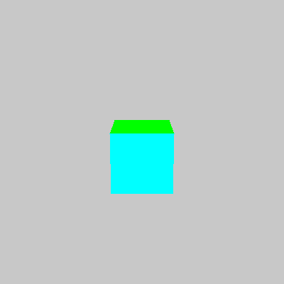
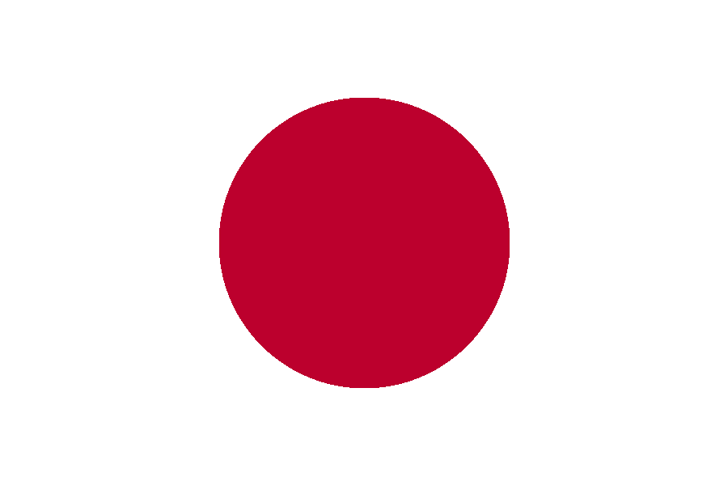
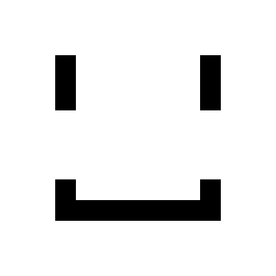

# Farba

[](https://crates.io/crates/farba)

[](https://actions-badge.atrox.dev/wowkster/farba/goto?ref=master)

A CPU graphics library written in pure Rust

The library is not concerned with displaying the image. It only fills up the memory with pixels. It's up to you what to do with those pixels.

The name is pronounced as "farba" (how its spelled) which is a Ukrainian word for "paint" ("фарба").

## Examples

### 3D Cube



```console
$ cargo run --example 3d_cube --features="window"
```

### Flag of Japan



```console
$ cargo run --example flag_of_japan --features="image"
```

```rust
use farba::{Canvas, RGBAColor};

const CANVAS_WIDTH: usize = 900;
const CANVAS_HEIGHT: usize = 600;

fn main() {
    let mut canvas = Canvas::new(CANVAS_WIDTH, CANVAS_HEIGHT);

    // Taken from https://upload.wikimedia.org/wikipedia/en/9/9e/Flag_of_Japan.svg
    canvas.fill(RGBAColor::WHITE);
    canvas.circle(
        (CANVAS_WIDTH / 2) as i32,
        (CANVAS_HEIGHT / 2) as i32,
        180,
        RGBAColor::from_rgb(0xBC, 0x00, 0x2D),
    );

    canvas.save_to_file("./examples/flag_of_japan.png");
}

```

### Rectangles



```console
$ cargo run --example rectangle --features="image"
```

```rust
use farba::{Canvas, RGBAColor};

fn main() {
    let mut canvas = Canvas::new(400, 400);

    canvas.fill(RGBAColor::WHITE);

    // Left eye
    canvas.rect(80, 80, 30, 80, RGBAColor::BLACK);

    // Right eye
    canvas.rect(290, 80, 30, 80, RGBAColor::BLACK);

    // Mouth
    canvas.rect(80, 260, 30, 60, RGBAColor::BLACK);
    canvas.rect(290, 260, 30, 60, RGBAColor::BLACK);
    canvas.rect(80, 290, 240, 30, RGBAColor::BLACK);

    canvas.save_to_file("./examples/rectangle.png");
}
```
